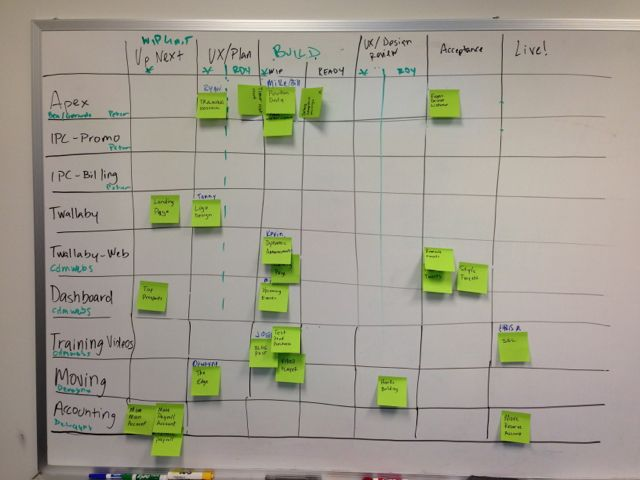

# Gaslight's Kanban Board

## What is Kanban?

### About Kanban

Kanban is a Japanese word which translates to "signal card". It's been
around for a very long time and was made popular in manufacturing by
Toyota. Kanban used a card to represent work in progress. For our
purposes, the card is usually a feature, bug or chore. 

Kanban is a pull system, which means that when work from the previous
column is marked as finished, the next "station" can pull that work in
and begin the process again. Once they're finished, it's again marked as
ready for the process to repeat with the next group.

As a project manager, the visual layout of the Kanban board is
appealing. You're quickly able to identify where work is needed as well
as where there is too much work happening.

Kanban is exciting because it distributes the workload as needed. By
placing limits on each column, no one gets overloaded.

### About Kaizen

Kaizen is also a Japanese word. It means "continuous improvement". The
result of a well organized Kanban board can contribute to a culture of
kaizen. Everyone is creative, smart and talented and we all enjoying
helping others on the team. 

## Goals

* Better visibility across all projects, client and internal.
* Ability to see when and where someone can help.
* Increase happiness by allowing people to be more productive.
* Ensure both internal and client projects are moving forward.
* Promote a culture of kaizen, or continuous improvement.
* Measure and decrease cycle time whenever possible.

## The Board

Currently, the board is located on the whiteboard in the back conference
room. Ideally, the board will be located in the large, shared workspace
where it's easily visible and updated regularly.

As you change the status of a card in the project's software tracker
(Pivotal Tracker, Trello, Kanbanery, JIRA, etc.), the physical board
should be updated as well. It might seem like you're duplicating your
individual effort, but the goal is for the physical board to be the
canonical source of project status for all Gaslighters. Not everyone
will have access to your particular project, but anyone should have the
opportunity to help when needed.

## How it Works

The board is very simple, which is intentional. Cards map one-to-one
with a story or card in the software tracker used on each project. Our
physical board is the authoritative source and the software trackers
should be up to date with the physical board. One of our goals is to
increase visibility and sharing, so that others can see when they have a
chance to help on all projects.  We've simplified the overall process so
that shared states can be used across all projects. For example, a story
in the "Started" state in Pivotal Tracker would be moved to the Build
state on our Kanban board.

As you move stories through the process, keep the physical card in sync.
Once you've completed development, move the card to the Ready column so
that someone knows it's time for design review and can jump in to help.

Because Kanban is a pull system, you can't simply move the card to the
next work phase when you're done with it. It's important that whoever is
doing the next work phase be able to pull the work into their queue when
they are ready for it. That means they need to be able to distinguish
between work in your queue that is still in progress and work that is
ready for them to pull. For that reason, each of the columns are split
into "in progress" and "ready".

If you're blocked by a work in progress limitation upstream, you've got
some slack time. Slack time is built in to the system to prevent
overloading an upstream function. You can use slack time as you see fit:
learn something new, write a blog post or jump in to help on another
project.

